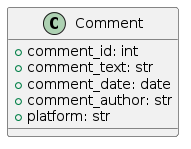

# Twitter API Python Project

## ***A Python Script That Utilizes The Twitter API to Fetch New Tweets and Store them in your relational Database of choice.***

## Table of Contents

- [Twitter API Python Project](#twitter-api-python-project)
  - [***A Python Script That Utilizes The Twitter API to Fetch New Tweets and Store them in your relational Database of choice.***](#a-python-script-that-utilizes-the-twitter-api-to-fetch-new-tweets-and-store-them-in-your-relational-database-of-choice)
  - [Table of Contents](#table-of-contents)
  - [Installation](#installation)
  - [Usage](#usage)
  - [License](#license)


## Installation

***1. Clone the repository:***

   ```bash
   https://github.com/ZahraneRabhi/Twitter-API.git
   ```

 ***2. Install the dependencies:***

   ```bash
   pip install -r requirements.txt
   ```
## Usage
***1. Set up your Twitter API credentials:***

Create a Twitter Developer account and create an application to get your API key, API secret key, Access token, and Access token secret.

***2. Set up your database:***
Create the table ***'comment'*** in your database of choice

<div style="text-align:left">
  
</div>


***3. Edit the config.py file:***

Update the config.py file with your Twitter API & Database credentials.

***4. Run the project:***
   ```Bash
   python app.py
   ```


## License

This project is licensed under the [MIT License](LICENSE).